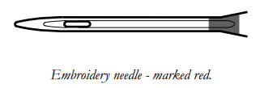
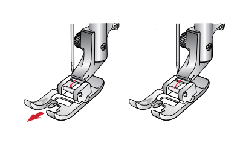
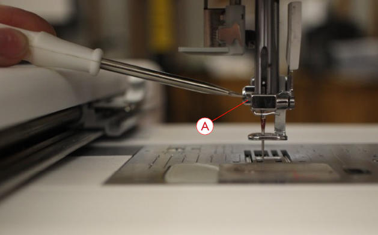
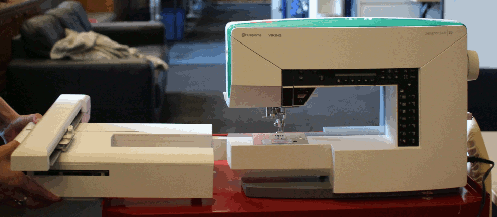
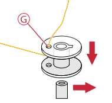
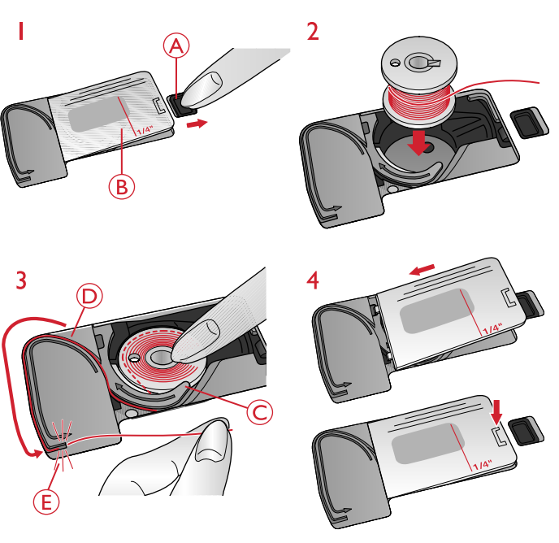
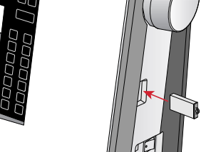
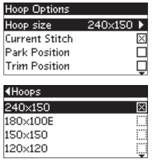
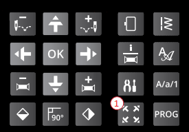

# STUDIO Embroidery Machine

This repository contains instructions for the use and maintenance of the STUDIO for Creative Inquiry's computerized embroidery machine, a Husqvarna [Viking Designer Jade 35](http://www.husqvarnaviking.com/en-US/Machines/DESIGNER-JADE-35). This document was authored by Tatyana Mustakos (Github: @tatyanade), October 2019.

---

# Contents

- [Using the Embroidery Machine](#using-the-Embroidery-Machine)
  * [Turning on the Machine](#turning-on-the-machine)
  * [Preparing the Machine for Embroidery](#preparing-the-machine-for-embroidery)
    + [Changing the Needle](#changing-the-needle)
      - [Needle Types](#needle-types)
    + [Changing the Foot](#changing-the-foot)
    + [Changing the Unit](#changing-the-unit)
  * [Preparing to Embroider](#preparing-to-embroider)
    + [Preparing the bobbin](#preparing-the-bobbin)
      - [Refilling a Bobbin](#refilling-a-bobbin)
        * [Winding the Bobbin Horizontally](#winding-the-bobbin-horizontally)
      - [Loading the Bobbin](#loading-the-bobbin)
    + [Getting the Hoop Ready](#getting-the-hoop-ready)      
      - [Hoop Overview](#hoop-overview)      
      - [Preparing the Hoop](#preparing-the-hoop)      
      - [Attaching and Removing the Hoop](#attaching-and-removing-the-hoop)
  * [Machine Basics](#machine-basics)      
    + [Raising/Lowering the Presser Foot](#raisinglowering-the-presser-foot)
    + [Raising/Lowering the Needle](#raisinglowering-the-presser-foot) 
 - [Embroidering](#Embroidering)
   * [Saving a file](#saving-a-file)
   * [Starting and Embroidery](#starting-an-embroidery)
     + [Opening a File](#opening-a-file)
       - [Setting the Hoop Size](#setting-the-hoop-size)
       - [Resizing the design](#resizing-the-design)
       - [Rotating and Mirroring the Design](#rotating-and-mirroring-the-design)
       - [Placing the Design](#placing-the-design)
     + [Start Embroidering!](#start-embroidering)
     + [While Embroidering...](#while-embroidering)
       - [rethreading the needle](#rethreading-the-needle)
       - [Changing Color for Multicolored Embroideries](#changing-color-for-multicolored-embroideries)
     + [Finishing the Embroidery](#finishing-the-embroidery)
 - [Software](#Software)       

---
 
# Using the Embroidery Machine

*Illustrations grabbed from the Viking Jade 35 [manual](Manual.pdf), a copy of which has been stored here.*

## Turning on the Machine

Plug the power cord into the power socket (A), located on the right side of the machine. Once it's plugged in, you can turn the machine on using the power switch (B) 

## Preparing the Machine for Embroidery

In this section, we will go over how to prepare the machine for embroidery. You will want to do this with the machine *off*. This will require us to attach the embroidery unit, and the embroidery foot, and optionally an embroidery needle.

### Changing the Needle
*make sure the machine is off*

You will need to change the needle if the needle is broken, or if you need to switch between an embroidery needle and sewing needle. Note that both work in embroidery mode, but the embroidery needle is less prone to fraying or breaking the thread.

Loosen the needle screw with the screwdriver, this will allow you to pull the needle out through the bottom. Once it's out, you can insert the new needle upwards with the flat side away from you. Push it all the way up, and then tighten the needle screw with the screwdriver

#### Needle Types

Universal needles have a slightly rounded point and come in
a variety of sizes. For general sewing on a variety of fabric
types and weights

Embroidery needles have a special scarf, a slightly rounded
point and a slightly larger eye to avoid damage to thread and
materials. Use with metallic and other specialty threads for
embroidery and decorative sewing.

### Changing the foot
*make sure the machine is off*

#### Different Feet
The two relevant feet to this guide are Utility Foot A, used for general sewing, and Embroidery/Darning Foot U.

*for full list of feet, view page 9 of manual*

#### Switching Utility Feet
With the power off, remove the current foot by sliding it towards you - it should snap in and out of place

#### Attaching Embroidery foot

<!--  -->
1. Turn off the power switch to prevent accidents.
2. Turn the hand wheel toward you until the needle is at its
highest point.
3. Raise the presser foot.
4. Remove the presser foot and holder by removing the
presser foot screw (A).

5. Change the needle to an embroidery needle (B)
6. Attach the Embroidery/Darning Foot U to the presser
bar (C) so that the arm (D) of foot rides on the shaft (E)
of the needle clamp.
7. Attach the presser foot screw (A) and tighten it. For
easier access, lower the needle slightly.

### Changing the Unit
*make sure the machine is off*

#### Overview
This is the embroidery unit, it holds the embroidery hoop in place and allows the machine to move the hoop in the x and y directions.

1. Embroidery unit plug
2. Embroidery arm
3. Embroidery unit release button (underside)
4. Level adjusting feet
5. Embroidery hoop attachment

#### Removing a Unit
If there is a different unit currently attached to the machine, you will want to remove it by sliding it out.

remove the sewing unit (or other unit) by sliding it left.

#### Attaching the Embrodiery Unit

Attach the embroidry unit by sliding it into location - it will snap into place.

## Preparing to Embroider

### Preparing the Bobbin

#### Refilling a Bobbin

##### Winding the Bobbin Horizontally

1. Place the felt pad and thread spool on the spool pin in horizontal position. Slide on a spool cap of the right type and direction.

2. Place the thread under the thread guide (A) from right to left. Pull the thread to the rear and around the thread guide (B) from left to right, then around thread guide (C) and into the notch (D).

3. Pull thread to the right and then through the thread guide (E) from front to back. Pass thread under tension disc (F) in clockwise direction. 
Note: Make sure the thread is pulled securely inside the tension disc
for correct thread tension.

4. Thread through the hole in the empty bobbin (G) from the inside to the outside.

5. Place the bobbin on the bobbin winder spindle. 

6. Push the bobbin spindle to the right to wind. A pop-up appears on the screen to inform you that bobbin winding is active. Press the start/stop button to start winding the bobbin. Hold the end of the thread firmly when starting to wind. When the bobbin is full, press the start/stop button again to stop. Push the bobbin spindle to the left. The pop-up closes. Remove the 
bobbin and cut the thread using the bobbin thread cutter
(H).

*Note: When winding the bobbin from auxiliary spool pin, do not hook
thread to the guide (C) and notch (D).*

#### Loading the Bobbin

*Make sure the needle is fully raised and the machine is turned off before inserting or removing the bobbin.*

1. Open the bobbin cover by pushing the release button to the right (A). Remove the cover (B). 
2. Insert the bobbin in the bobbin case with the thread running in a counterclockwise direction. 
3. With a finger held gently on top of the bobbin, pull the thread into notch (C). Then pull the thread at arrow
markings into the needle plate thread guide from (C) to (D). Pull the thread at the arrow markings into the needle
plate thread guide from (D) to (E). To cut off excess thread, pull thread to the right, over the blade (E).
4. Replace the bobbin cover

### Getting the Hoop Ready

#### Hoop Overview

Hoop Overview

1. Embroidery hoop connector
2. Outer hoop
3. Inner hoop
4. Quick release
5. Retaining screw
6. Center marks

#### Preparing the Hoop

To put the fabric into the hoop, place the outer hoop on the table,open the quick release (A) and loosen the screw (B). Put the fabric backing and fabric on top of the hoop, with the fabric on the topmost. Then, place the inner hoop on top of the fabric, and press it firmly into the outer hoop. Close the quick release, and turn the screw until the fabric is secured firmly. The fabric should be taut for best results.

#### Attaching and Removing the Hoop 

Slide the hoop connector into the hoop attachment (A), it will click into place. You will need to raise the presser foot past the raised position to make sure the hoop can fit underneath. To remove the hoop from the embroidery arm, press the grey button (B) on the hoop attachment and slide the hoop towards you.

## Machine Basics 

### Raising/Lowering the Presser Foot

The presser foot is lowered or raised with the presser foot lift, it is raised when lifted up (A), and lowered when pushed down (B) . The presser foot can be raised higher (C) to make it
easier to slide the the embroidery hoop into location.

### Raising/Lowering the Needle

Turn the Handwheel (A) to raise or lower the needle manually.

# Embroidering

## Saving a File
*note that the Husqvarna Viking can only read .vp3 files*

Once you have a file ready to embroider, plug the USB into your laptop and save your file within the desired folder.

## Starting an Embroidery

### Opening a File

To open a file, plug the USB into the embroidery machine, then turn the machine on.
#### Setting the Hoop Size

Once you have loaded your file, the first thing you will need to do is set the hoop size. Do this by pressing the hoop options button (A).

Select the hoop size you are planning on using, if a specific size is unselectable, that means your design is too big to fit on it.

#### Resizing the Design

You can increase or decrease the size of the deisgn up to 20%. Use the first set of + and - (1) to adjust the height, and the second set of + and 0 (2) to adjust the width. Each press of a button scales by 5%. The stitch count remains the same throughout resizing.

#### Rotating and Mirroring the Design

To rotate the design around its center point, press the rotate button (B). This will rotate the design 90 degrees clockwise. If the design is to large to rotate by 90 degrees, the rotate button will rotate it 180 degrees.

The Mirror buttons, (A) and (C), will mirror the design horizontally and vertically.

#### Placing the Design

*note that pressing OK will NOT start embroidering, but will recenter your design on the screen*

You can use the 4 arrow keys to move your design around and determine where on the fabric it will be embroidered. You can use the **Corner Check** button (1) to preview the size by having the machine trace the corners of your design so you can see the actual size and placement of your file.

### Start Embroidering!

*Before you start embroidering, make sure that the bobbin has enough thread to finish your design, as you cannot replace it without restarting the embroidery*

to start the embroidery, press the Stop/Start button. follow directions of the screen.

### While Embroidering...

#### Rethreading the needle

The thread may break while you are embroidering. If it does, the machine will stop and ask you to RETHREAD the needle.

#### Changing Color for Multicolored embroideries

If you're design has multiple colors, the machine will stop after it is done with one color section, and ask you to switch thread. To do this, remove the spool and rethread the machine with the new desired color.

### Finishing the embroidery

When the emboridery is done, the screen will let you know. Cut the thread and Remove the hoop. Open the hoop and take out the embrodiery

# Software

## PremierPlus

Free version with limited features
https://www.premierplusembroidery.com/en/Downloads/PP-Software-Downloads

## InkStitch

free add on for inkscape
https://inkstitch.org/

## Sewart

30-day free trial
https://www.thebabysbooty.com/sewart

## EmbroiderPY/EmbroideryIO

Python/Java library for exporting embroidery files
https://github.com/EmbroidePy
